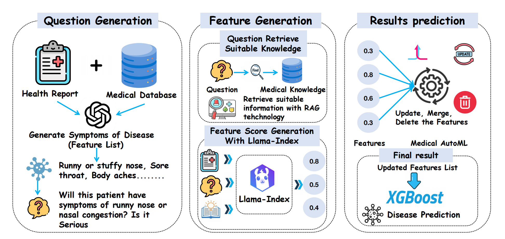

# HealthLLM
### The whole structure
<center>
  


<center>
Paper is available on https://arxiv.org/abs/2402.00746

### Train the model
  -  `python compute_health_score.py`

### Cite this paper
You are encouraged to cite the following paper for academic research.
```
@misc{jin2024healthllm,
      title={Health-LLM: Personalized Retrieval-Augmented Disease Prediction System}, 
      author={Mingyu Jin and Qinkai Yu and Dong Shu and Chong Zhang and Lizhou Fan and Wenyue Hua and Suiyuan Zhu and Yanda Meng and Zhenting Wang and Mengnan Du and Yongfeng Zhang},
      year={2024},
      eprint={2402.00746},
      archivePrefix={arXiv},
      primaryClass={cs.CL}
}
```
